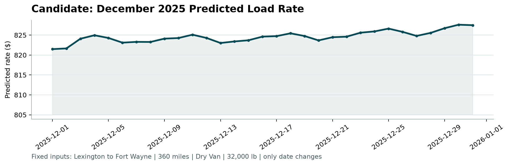

# Freight Rate Prediction — Spotter

> **Assessment brief:** [`freight-rate-ml-assessment.pdf`](freight-rate-ml-assessment.pdf)  
> **Generation steps:** [`STEPS.md`](STEPS.md)  
> **Full technical report:** [`reports/final_report.md`](reports/final_report.md) · [`reports/final_report.docx`](reports/final_report.docx)  
> **December chart output:** [`scorer_results/candidate_december.png`](scorer_results/candidate_december.png)  
> **Final predictions:** [`validation_predictions.csv`](validation_predictions.csv) (12,000 rows)

---

## Table of Contents

- [Deliverables](#deliverables)
- [Project Structure](#project-structure)
- [Tech Stack](#tech-stack)
- [Quickstart](#quickstart)
- [Data & Cleaning Pipeline](#data--cleaning-pipeline)
- [Feature Engineering](#feature-engineering)
- [Algorithm Choice & Model Selection](#algorithm-choice--model-selection)
- [Final Hyperparameters](#final-hyperparameters)
- [Results](#results)
- [Reproducing Results](#reproducing-results)
- [Interactive Dashboard](#interactive-dashboard)

---

## Deliverables

| Item | File | Status |
|------|------|--------|
| Code, dependencies & run instructions | this repo · [`STEPS.md`](STEPS.md) | ✅ |
| 12,000-row submission | [`validation_predictions.csv`](validation_predictions.csv) | ✅ |
| Technical report | [`reports/final_report.md`](reports/final_report.md) · [`reports/final_report.docx`](reports/final_report.docx) | ✅ |
| December chart (official scorer) | [`scorer_results/candidate_december.png`](scorer_results/candidate_december.png) | ✅ |
| Loom walkthrough (2–3 min) | 🔗 *[insert link]* | ⏳ |

---

## Project Structure

```text
Spotter/
├── data/
│   ├── train-test.csv                     # 48,000 labeled loads (Jan – Oct 2025)
│   ├── validation.csv                     # 12,000 unlabeled loads (Nov – Dec 2025)
│   ├── validation-predictions-template.csv
│   └── december-chart-inputs.csv          # Fixed 31-day December scenario
│
├── STEPS.md                               # How to generate model output + chart
├── reports/
│   ├── final_report.md                    # EDA findings, model selection, results
│   └── final_report.docx                  # Same report (assessment DOCX)
│
├── scorer_results/
│   └── candidate_december.png             # ✅ Generated by score.py
│
├── src/
│   ├── features/
│   │   └── build_features.py              # Date extraction, imputation, interactions
│   ├── benchmark.py                       # 5-model benchmark comparison
│   └── train.py                           # End-to-end training & inference ⭐
│
├── Dockerfile                             # python:3.11-slim + uv 0.11.6
├── docker-compose.yml                     # Services: runner | dashboard
├── pyproject.toml                         # PEP 621 dependencies (uv-managed)
├── uv.lock                                # Exact locked dependency tree
├── score.py                               # Official scorer (unmodified)
└── validation_predictions.csv             # ✅ Final submission
```

---

## Tech Stack

| Layer | Tool | Version | Purpose |
|-------|------|---------|---------|
| **Language** | Python | 3.11 | Core runtime |
| **Dependency mgmt** | [uv](https://docs.astral.sh/uv/) | 0.11.6 | Fast, locked, reproducible installs |
| **Containerisation** | Docker + Compose | — | Fully reproducible execution |
| **ML** | scikit-learn `HistGradientBoostingRegressor` | ≥ 1.9.1 | Training & inference |
| **Data** | pandas | ≥ 3.0.6 | Data loading, cleaning, feature engineering |
| **Numerics** | NumPy | (pandas dep) | Haversine calculations, cyclical encodings |
| **Dashboard** | Streamlit | ≥ 1.40 | Interactive rate predictor & analytics |
| **Charts** | Plotly | ≥ 5.24 | All visualisations inside dashboard |
| **Plotting** | Matplotlib | ≥ 3.11.2 | Scorer output chart |

Dependencies are declared in [`pyproject.toml`](pyproject.toml) and pinned in [`uv.lock`](uv.lock).

---

## Quickstart

This project uses **`uv`** for dependency management and **Docker** for fully reproducible execution.

### Option 1 — Docker *(recommended)*

No local Python setup required. Runs inside a container with the exact locked environment.

```bash
# Full training pipeline → generates validation_predictions.csv + scorer chart
docker compose run runner

# Interactive dashboard
docker compose up dashboard
# → open http://localhost:8501
```

See [`docker-compose.yml`](docker-compose.yml) and [`Dockerfile`](Dockerfile) for service definitions.

### Option 2 — uv (local)

Install `uv` with the official one-line installer, then sync the locked environment:

```bash
curl -LsSf https://astral.sh/uv/install.sh | sh
uv sync                          # creates .venv; installs exact locked deps

uv run python src/train.py       # train + generate predictions

uv run python score.py \
  --predictions validation_predictions.csv \
  --december-predictions data/december-chart-inputs.csv
```

### Option 3 — pip / virtualenv

```bash
python -m venv .venv && source .venv/bin/activate
pip install -r requirements.txt scikit-learn

python src/train.py
python score.py \
  --predictions validation_predictions.csv \
  --december-predictions data/december-chart-inputs.csv
```

---

## Data & Cleaning Pipeline

Source: [`src/features/build_features.py`](src/features/build_features.py) · [`src/eda.py`](src/eda.py)

### Datasets

| Dataset | Rows | Date Range | Notes |
|---------|------|-----------|-------|
| `train-test.csv` | 48,000 | Jan 1 – Oct 31, 2025 | Has `posted_rate` label |
| `validation.csv` | 12,000 | Nov 1 – Dec 31, 2025 | No label — to predict |
| `december-chart-inputs.csv` | 31 | Dec 1–31, 2025 | Fixed scenario, daily |

**Columns:** `load_id`, `pickup`, `delivery`, `pickup_lat`, `pickup_lon`, `delivery_lat`, `delivery_lon`, `distance`, `equipment`, `weight`, `date`, `market_index`, `quote_signal` (+ `posted_rate` in train only).

### EDA Key Findings

- Mean posted rate **$2,374** | Median **$2,031** | Std **$1,486** — right-skewed
- `distance` alone explains **~83% of variance** (Pearson r = 0.91)
- Rate-per-mile is far tighter: median **$2.15/mile**, std **$0.58** → better prediction target
- Equipment: 3 classes (Dry Van, Flatbed, Reefer) — fully covered in both splits
- Cities: 64 unique in training; validation adds **8 completely unseen cities**
- `market_index` peaks Apr–May (~1.3), dips Sep (~0.89); Nov–Dec ~0.93 — no major distribution shift

### Missing Values

| Column | Train (48k) | Validation (12k) | Fix |
|--------|-------------|-----------------|-----|
| `weight` | 300 rows (0.6%) | 165 rows (1.4%) | Median imputation (train median applied to valid) |
| `market_index` | 374 rows (0.8%) | 249 rows (2.1%) | Median imputation (train median applied to valid) |

`HistGradientBoostingRegressor` also handles remaining NaNs natively at inference time — no silent failures.

### Cleaning Steps (in order)

1. **Parse dates** — `pd.to_datetime(df["date"])` for consistent temporal features
2. **Median imputation** — `weight` and `market_index` filled with train-set medians; same medians applied to validation to prevent leakage
3. **Coordinate defaults** — December scenario cities (`Lexington`, `Fort Wayne`) seeded directly from known lat/lon constants if absent from city dict
4. **Derived target** — `rate_per_mile = posted_rate / distance` computed on training set only
5. **Lane label** — `pickup + " → " + delivery` string for display grouping

---

## Feature Engineering

Source: [`src/features/build_features.py`](src/features/build_features.py) · [`src/train.py`](src/train.py)  
Full documentation: [`reports/final_report.md § 4`](reports/final_report.md)

**Total: 36 features** — no one-hot encoding; `HistGB` handles categoricals natively.

| Group | Features |
|-------|----------|
| **Geospatial** | `haversine_miles`, `bearing` (compass angle), `distance − haversine` (routing overhead), `circuitous_ratio` |
| **Distance transforms** | `log(distance+1)`, `sqrt(distance)` |
| **Weight** | `log(weight+1)`, `distance × weight`, `weight / distance` |
| **Market & quote** | `market × quote`, `market × distance`, `quote × distance` |
| **Temporal** | `month`, `day`, `day_of_week`, `day_of_year`, `is_weekend`, cyclical `sin/cos` for month & day-of-week |
| **Target encoding** | Smoothed rate-per-mile mean by `pickup`, `delivery`, `equipment` (prior weight = 15 loads; falls back to global mean for unseen cities) |

The **target encoding** columns (`pickup_te_rpm`, `delivery_te_rpm`, `equipment_te_rpm`) are the two most important features — they encode lane-specific pricing history without memorising city names. Unseen cities gracefully fall back to the global $2.15/mile mean.

---

## Algorithm Choice & Model Selection

Source: [`src/benchmark.py`](src/benchmark.py) · [`reports/final_report.md § 5`](reports/final_report.md)

Five candidates were evaluated on a **strict time-based holdout** (Jan–Aug train → Sep–Oct holdout) to mimic the actual deployment scenario. Random splits were explicitly avoided to prevent temporal leakage.

### Benchmark Results

| Model | MAE | RMSE | R² |
|-------|-----|------|----|
| **HistGB — rate/mile, L1** *(winner)* | **$115** | $636 | **0.826** |
| HistGB — rate/mile, L2 | $133 | $639 | 0.825 |
| HistGB — direct rate, L1 | $121 | $639 | 0.825 |
| HistGB — direct rate, L2 | $159 | $647 | 0.820 |
| Weighted ensemble (all four) | $121 | $640 | 0.824 |

### Why `HistGradientBoostingRegressor`?

- **Native missing value support** — handles NaN in `weight` and `market_index` without pre-imputation
- **Native categoricals** — `pickup`, `delivery`, `equipment` passed directly as category dtype; no label encoding needed
- **L1 (absolute error) loss** — robust to the long tail of high-value haul loads; avoids RMSE-driven bias toward outliers
- **`n_iter_no_change=50`** — early stopping on a 5% internal validation split prevents overfitting to Jan–Aug seasonality
- ~**13% MAE improvement** over direct `posted_rate` prediction ($115 vs $133) by normalising to rate-per-mile first

### Why Rate-per-Mile as Target?

Predicting `posted_rate / distance` (rate-per-mile) then multiplying back by distance:
1. Removes scale dependency — short- and long-haul loads learn the same $/mile signal
2. Reduces variance in the label distribution (std drops from $1,486 → $0.58/mile)
3. Lets the model generalise across unseen distance ranges

---

## Final Hyperparameters

```python
HistGradientBoostingRegressor(
    loss="absolute_error",       # L1: robust to long-haul outliers
    max_iter=700,                # boosting rounds
    learning_rate=0.035,         # slow learning → lower generalisation error
    max_leaf_nodes=63,           # tree complexity cap
    min_samples_leaf=20,         # prevents overfitting to rare lanes
    l2_regularization=0.5,       # shrinkage on leaf weights
    categorical_features=["pickup", "delivery", "equipment"],
    random_state=42,
    n_iter_no_change=50,         # early stopping patience
    validation_fraction=0.05,    # 5% internal val set for early stopping
)
```

---

## Results

### Holdout Performance (Sep–Oct 2025, 9,523 loads)

| Metric | Value |
|--------|-------|
| MAE | **$115.01** |
| RMSE | **$635.95** |
| R² | **0.8263** |

### December Forecast Chart

Generated by running `score.py` on the completed `december-chart-inputs.csv`:



Full chart: [`scorer_results/candidate_december.png`](scorer_results/candidate_december.png)

---

## Reproducing Results

```bash
# 1. Clone
git clone https://github.com/AtishNikalje/Spotter.git
cd Spotter

# 2. Set up environment
curl -LsSf https://astral.sh/uv/install.sh | sh
uv sync

# 3. Train and generate predictions
uv run python src/train.py

# 4. Score and produce December chart
uv run python score.py \
  --predictions validation_predictions.csv \
  --december-predictions data/december-chart-inputs.csv

# Expected output:
# Validated 12,000 final predictions.
# Validated 31 fixed December predictions.
# Created chart: scorer_results/candidate_december.png
```

---

## Interactive Dashboard

Launch after syncing the environment:

```bash
uv run streamlit run dashboard.py
# → open http://localhost:8501
```

**Tabs:**

| Tab | What it shows |
|-----|--------------|
| 🎯 Rate Predictor | Live inference — pick any city pair, trailer, date & weight |
| 📊 Market Overview | KPI summary, rate-by-distance scatter, monthly trend |
| 🗓️ December Forecast | Daily predicted rates for the fixed Dec scenario + scorer chart |
| 📁 Data | Browse validation predictions & training history; download CSV |

Source: [`dashboard.py`](dashboard.py)
